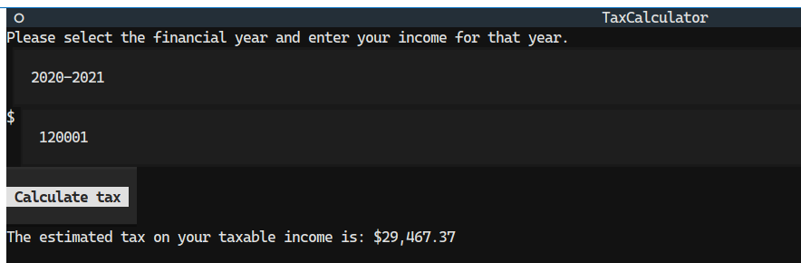

# General coding exercise

## Introduction

A simple tax calculator, designed to recreate a simpler version
of the official Australian Tax calculator website found at:
https://www.ato.gov.au/single-page-applications/calculatorsandtools#STC/questions

Implemented in python for simplicity and coding velocity.

## Instructions

### Running locally

This was developed using Python 3.11. I haven't tested it on other versions of Python.

1. `python -m venv .venv`
2. `source .venv/bin/activate`
3. `pip install -r requirements.txt`
4. `python tax_calculator.py`

### Running using Docker

1. `docker run --rm -it -p 8000:8000 $(docker build -q .)`
2. Connect using a browser at http://localhost:8000

## Goals

- [x] Cater for 2021-22 and 2020-2021 tax years
- [x] Implement ATO tax rates and how they work.
- [x] At least choose a year and an income, report tax estimate

Stretch goals:

- [ ] Maybe report tax rates per FY in a table?
- [x] Maybe a more involved GUI?
- [x] Deployment: Can we serve this online
- [x] Do we want to serve this using Docker etc?
- [ ] Do we care about scalability?

## Considerations

0. My first thought is to just scrape the ATO site, but I think that might be
   against the spirit of the thing :)
1. Input is a FY (a string like `2020-2021`) and an income
   (a number, let's make it a float for now)
2. Output is a float to 2 decimal places. Bonus points for nice
   number formatting like `$21,732.00`
3. Unit tests are good, let's add those
4. The problem statement doesn't mention residency
   considerations or the medicare levy, so let's not add this
   for now
